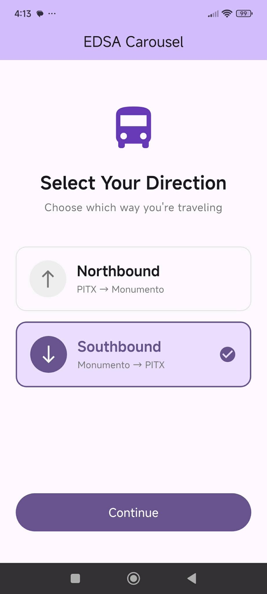
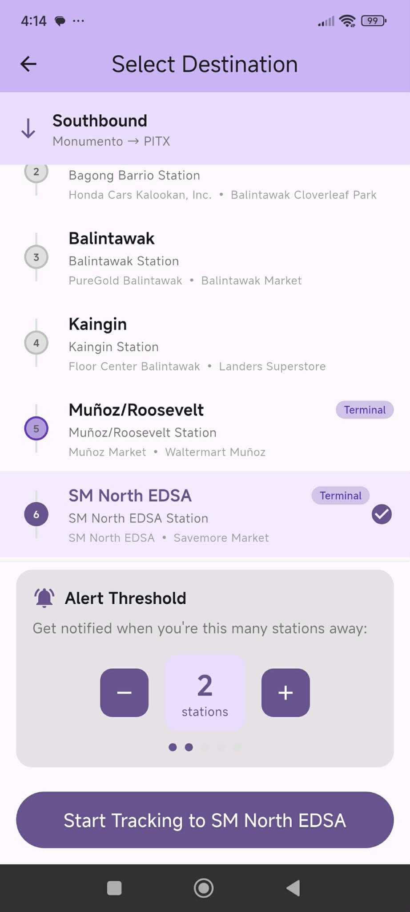
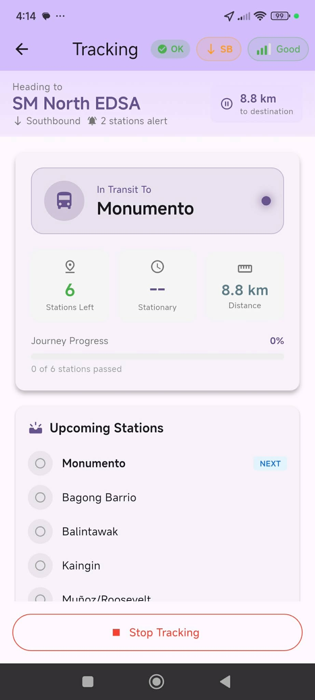
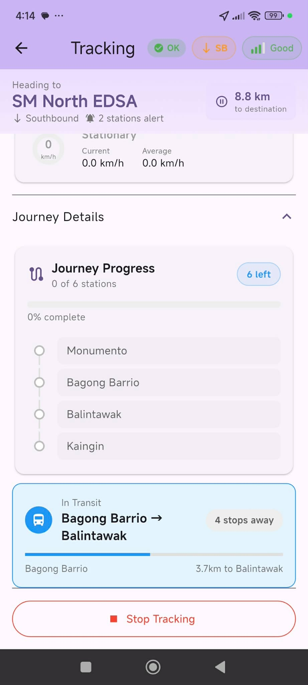

# 🚌 EDSA Carousel Tracker

A Flutter app to track your journey on the EDSA Carousel Bus System in Metro Manila, Philippines. Get notified when you're approaching your destination — even while you sleep!

## 📖 The Story

As a daily commuter on the EDSA Carousel, I often found myself dozing off during long rides. The fear of missing my stop was real! I needed a simple solution: an app that would wake me up when I'm close to my destination.

This app was born out of that personal need. It uses your phone's GPS to track your position along the EDSA Carousel route and sends you notifications when you're approaching your stop. No more missed stations, no more oversleeping past your destination.

## ✨ Features

- **🗺️ Real-time Location Tracking** — Continuously monitors your position along the EDSA Carousel route
- **🔔 Smart Notifications** — Alerts you when approaching your destination (configurable: 1-5 stations before arrival)
- **🧭 Automatic Direction Detection** — Intelligently determines if you're heading Northbound (PITX → Monumento) or Southbound (Monumento → PITX)
- **⏱️ ETA Calculation** — Estimates your arrival time based on current speed and traffic conditions
- **📊 Journey Progress** — Visual progress bar showing stations passed and remaining
- **🌓 Dark Mode** — Easy on the eyes for early morning or late night commutes
- **⚠️ Edge Case Handling** — Detects GPS issues, traffic slowdowns, and wrong direction travel

## 🚉 Supported Stations

The app covers all 22 stations of the EDSA Carousel route:

**Northbound (PITX → Monumento):**
PITX → MOA → Roxas Blvd. → Taft → Tramo → Ayala → Buendia → Guadalupe → Ortigas → Santolan →  Main Avenue → Nepa Q-Mart → GMA Kamuning → Quezon Ave. → PhilAm → North Ave. → SM North EDSA → Roosevelt/Muñoz → Kaingan → Balintawak → Bagong Barrio → Monumento

**Southbound (Monumento → PITX):**
Monumento → Bagong Barrio → Balintawak → Kaingan → Roosevelt/Muñoz → SM North EDSA → North Ave. → PhilAm → Quezon Ave. → GMA Kamuning → Nepa Q-Mart → Main Avenue → Santolan → Ortigas → Guadalupe → Buendia → Ayala → Tramo → Taft → Roxas Blvd. → MOA → PITX

## 📱 Screenshots

<p align="center">
    
    
    
</p>
<p align="center">
    
    
</p>

## 🛠️ Tech Stack

- **Framework:** Flutter 3.29+
- **State Management:** Riverpod
- **Location Services:** Geolocator
- **Notifications:** Flutter Local Notifications
- **Persistence:** Shared Preferences

## 🚀 Getting Started

### Prerequisites

- Flutter SDK 3.29 or higher
- Android device with GPS (Android 8.0+) or iOS device (iPhone/iPad)
- Location permissions enabled

### Supported Platforms

| Platform | Status |
|----------|--------|
| Android  | ✅ Supported (Android 8.0+) |
| iOS      | ✅ Supported |
| Web      | ❌ Not supported |
| Desktop  | ❌ Not supported |

### Installation

1. Clone the repository:
   ```bash
   git clone https://github.com/yourusername/carouselapp.git
   cd carouselapp
   ```

2. Install dependencies:
   ```bash
   flutter pub get
   ```

3. Run the app:
   ```bash
   flutter run
   ```

### Building for Release

**Android:**
```bash
flutter build apk --release
```

**iOS:**
```bash
flutter build ios --release
```

## 🤝 Contributing

This started as a personal project, but contributions are welcome! Here's how you can help:

### Ways to Contribute

1. **🐛 Report Bugs** — Found an issue? Open a GitHub issue with details about what went wrong
2. **💡 Suggest Features** — Have an idea to make the app better? I'd love to hear it
3. **📍 Update Station Data** — Know of station location inaccuracies? Help improve the GPS coordinates
4. **🌐 Add Translations** — Help make the app accessible in Filipino and other languages
5. **📝 Improve Documentation** — Help others understand and use the app better
6. **🔧 Submit Pull Requests** — Code contributions are always appreciated

### Development Guidelines

1. Fork the repository
2. Create a feature branch (`git checkout -b feature/amazing-feature`)
3. Commit your changes (`git commit -m 'Add amazing feature'`)
4. Push to the branch (`git push origin feature/amazing-feature`)
5. Open a Pull Request

### Code Style

- Follow the [Dart style guide](https://dart.dev/guides/language/effective-dart/style)
- Run `flutter analyze` before submitting PRs
- Add comments for complex logic

## 📁 Project Structure

```
lib/
├── main.dart                 # App entry point
├── models/
│   └── station.dart          # Station model and route direction enum
├── screens/
│   ├── direction_selection_screen.dart
│   ├── destination_selection_screen.dart
│   └── tracking_screen.dart
├── services/
│   ├── station_provider.dart         # Station data management
│   ├── location_tracking_service.dart # GPS tracking
│   ├── station_detection_service.dart # Proximity detection
│   ├── direction_inference_service.dart # Auto direction detection
│   ├── station_progression_service.dart # Journey progress
│   ├── eta_service.dart              # ETA calculations
│   ├── notification_service.dart     # Push notifications
│   ├── alert_manager.dart            # Alert logic
│   ├── edge_case_handler.dart        # Error handling
│   └── theme_service.dart            # Theme management
├── widgets/
│   ├── live_status_display.dart
│   ├── eta_display.dart
│   ├── station_detection_display.dart
│   └── ...
assets/
└── stations.json             # Station coordinates and data
```

## ⚠️ Disclaimer

This app is an independent project and is **not affiliated** with the Department of Transportation (DOTr) or any official EDSA Carousel operations. Station locations are approximated and may not be 100% accurate.

**Use responsibly** — While this app can help alert you, always stay aware of your surroundings and don't rely solely on the app for navigation.

## 📄 License

This project is licensed under the MIT License — see the [LICENSE](LICENSE) file for details.

## 🙏 Acknowledgments

- The EDSA Carousel system for making Metro Manila commutes more bearable
- The Flutter community for amazing packages and support
- Fellow commuters who inspired this app by sharing the same struggle

---

**Made with 💜 by a sleepy commuter**

*If this app helped you catch your stop, consider giving it a ⭐!*
